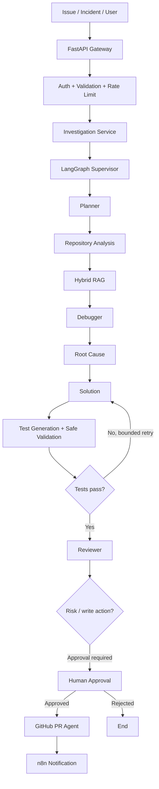
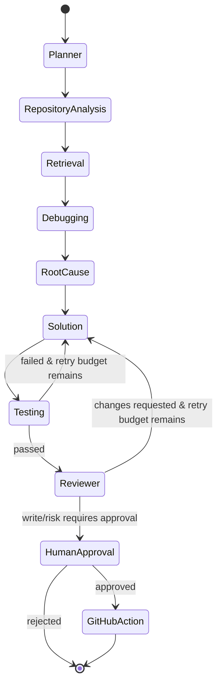

# Enterprise AI Software Engineering & Incident Resolution Agent

Production-style monorepo for evidence-grounded software incident investigation with LangGraph orchestration, hybrid RAG, human approval, controlled GitHub PR creation, MCP-style tool boundaries, observability, evaluation, and a Next.js dashboard.

> **Development-safe by default:** the included demo runs without paid LLM credentials and simulates GitHub write actions. Real providers and GitHub writes are opt-in.

## What works in the included demo

- Register/index a local repository fixture.
- Parse code/docs with code-aware chunking and metadata.
- Hybrid lexical + vector-like deterministic retrieval with reciprocal-rank fusion.
- Run a typed incident workflow: plan → repository analysis → retrieval → hypotheses → root cause → patch → tests → review → approval.
- Persist investigations, events, evidence, approvals, usage and audit data.
- Pause before repository writes / PR creation.
- Approve, reject, or request changes.
- Safely simulate a PR in development mode.
- Stream workflow progress with SSE.
- Run deterministic evaluation and pytest suites.
- Start backend, worker dependencies, Qdrant, Redis, PostgreSQL, frontend and optional n8n through Docker Compose.

## Architecture



### Why these choices

- **LangGraph** is the primary workflow engine because incident resolution is stateful, conditional, interruptible, resumable, and must enforce bounded loops.
- **LangChain** is limited to model/provider and document abstractions; orchestration remains explicit.
- **CrewAI** is optional and isolated to a collaborative review adapter, avoiding duplicate orchestration.
- **Hybrid RAG** combines lexical matching and dense retrieval because identifiers/stack traces favor lexical search while conceptual questions favor semantic search.
- **RRF + optional reranking** provides robust fusion without forcing incomparable raw scores.
- **Qdrant abstraction** makes vector storage replaceable; the local deterministic backend lets the demo work offline.
- **PostgreSQL** is the durable system of record; **Redis** handles cache/rate-limit/coordination only.
- **ARQ-style worker boundary** is represented by a queue service; Docker runs a worker process and local mode can execute inline for deterministic demos.
- **MCP** boundaries expose repository/GitHub/document capabilities through typed, permission-checked tools rather than arbitrary shell access.
- **Human approval** is mandatory for write actions.

## Quick start

```bash
cp .env.example .env
docker compose up --build
```

Backend: `http://localhost:8000`  
Frontend: `http://localhost:3000`  
OpenAPI: `http://localhost:8000/docs`  
n8n (optional profile): `docker compose --profile automation up n8n`

Run the deterministic demo without Docker:

```bash
cd backend
python -m venv .venv
source .venv/bin/activate
pip install -e ".[dev]"
uvicorn app.main:app --reload
```

Then:

```bash
curl -X POST http://localhost:8000/api/v1/repositories/index \
  -H 'Content-Type: application/json' -H 'X-API-Key: dev-key' \
  -d '{"name":"checkout-demo","path":"../demo_repo","branch":"main"}'

curl -X POST http://localhost:8000/api/v1/investigations \
  -H 'Content-Type: application/json' -H 'X-API-Key: dev-key' \
  -d '{"repository_id":"checkout-demo","title":"Checkout 500","description":"Checkout requests started returning HTTP 500 after the latest deployment."}'
```

## Agent workflow

Every conclusion separates **evidence**, **inference**, and **assumptions**. File citations are validated against indexed chunks. The workflow can return `INSUFFICIENT_EVIDENCE` instead of inventing a root cause.



## Security model

Repository content is **untrusted data**. Retrieved code/comments/README text is wrapped as evidence and never promoted to system instructions. Paths are normalized and restricted to registered repository roots. Tools use explicit permissions: `READ_ONLY`, `SAFE_EXECUTION`, `WRITE_REPOSITORY`, `CREATE_PR`. Subprocess execution uses fixed allowlists, argument arrays, timeouts, and no shell. Secrets are redacted from logs. GitHub webhook signatures use HMAC verification.

## API

- `GET /health`
- `POST /api/v1/repositories/index`
- `GET /api/v1/repositories/{id}/status`
- `POST /api/v1/investigations`
- `GET /api/v1/investigations/{id}`
- `GET /api/v1/investigations/{id}/events`
- `GET /api/v1/investigations/{id}/evidence`
- `GET /api/v1/investigations/{id}/usage`
- `GET /api/v1/investigations/{id}/stream` (SSE)
- `POST /api/v1/investigations/{id}/approve`
- `POST /api/v1/investigations/{id}/reject`
- `POST /api/v1/investigations/{id}/request-changes`
- `POST /api/v1/github/webhook`

## Configuration

See `.env.example`. `LLM_PROVIDER=deterministic` is the safe default. Provider adapters are present for OpenAI, Anthropic, Gemini, and Ollama configuration; unavailable optional providers fail clearly instead of silently falling back.

## Evaluation

```bash
python evaluation/run_eval.py
```

Metrics include Precision@K, Recall@K, MRR, citation validity, root-cause correctness, patch validity, latency and usage.

## Testing

```bash
cd backend
pytest
ruff check .
black --check .
mypy app
```

Tests cover RRF, parsers/chunking, permission checks, path traversal, prompt-injection treatment, API auth, structured state, approval behavior, and deterministic incident resolution.

## n8n

Import `n8n/workflows/github-incident-investigation.json`. It receives an issue/webhook, calls the investigation API, and can notify a downstream webhook. LangGraph remains the reasoning engine.

## Development assistants

`CLAUDE.md`, `.cursor/rules/project.mdc`, and `.github/copilot-instructions.md` encode architecture, security, test, and change rules so AI coding tools operate within the same engineering constraints.

## Real integration notes

The repository is runnable without external credentials. Real GitHub PR creation requires `GITHUB_WRITE_ENABLED=true`, a least-privilege token, and an approved workflow state. Real model providers require their corresponding keys. The deterministic provider is not presented as a real LLM; it exists for repeatable local testing.

## Roadmap

- Production Postgres-backed LangGraph checkpointer
- Real Qdrant embeddings with selectable embedding providers
- Kubernetes deployment and distributed workers
- Organization/repository RBAC
- LangSmith/OpenTelemetry exporters
- Browser-based diff approval with inline comments
